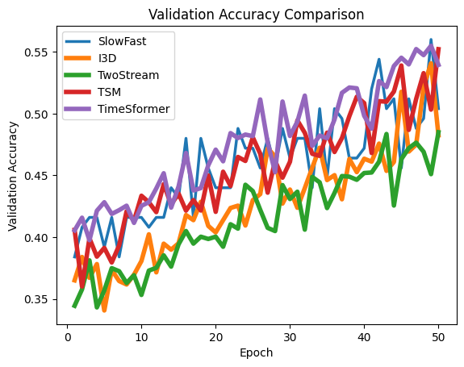
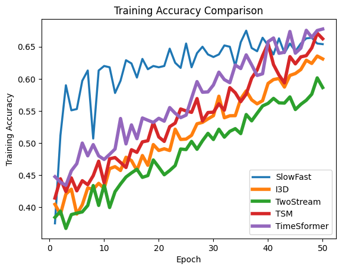

<!-- Logo first (no heading above) -->
<p align="center">
  
</p>

<h1 align="center">StreamSafe 4D</h1>

<p align="center">
  Real-time industrial safety “digital twin” for factories and warehouses — video → inference → Kafka (Confluent Cloud) → analytics + Gemini reports.
</p>

---

StreamSafe 4D is a real-time industrial safety “digital twin” for factories and warehouses. Cameras (or recorded warehouse videos) feed lightweight edge services that detect people and classify short clips into <b>safe/unsafe workplace behaviors</b>. These events, together with machine telemetry, are published into <b>Kafka (Confluent Cloud)</b> as “data in motion”. A React dashboard provides operational views (zones/workers/alerts/analytics) and a <b>Safety Reports</b> section where <b>Gemini</b> turns incident streams into human-readable explanations, shift summaries, and actionable checklists.

---

## Repository structure

- `StreamSafe-backend/`
  - Inference + streaming service: YOLO person detection + SlowFast behavior classification
  - Publishes JSON events to Kafka (Confluent Cloud)
  - Serves annotated video frames as MJPEG via FastAPI (`/stream`)
- `StreamSafe-frontend/`
  - React + Vite dashboard UI (routing via Wouter, UI via shadcn components)
  - Includes AI-driven `Safety Reports` page (Gemini)
- `README.md` (this file)
  - High-level overview and quickstart

---

## Training results (model comparison)

We evaluated five representative and widely used action recognition models—**SlowFast**, **I3D**, **TwoStream**, **TSM**, and **TimeSformer**—under a unified training and evaluation protocol on our dataset to ensure a fair comparison. All models were trained for the same number of epochs with matched input resolutions, optimization settings, and data splits, and were assessed using identical validation metrics.

While transformer-based and efficient temporal models showed competitive learning trends, **SlowFast consistently achieved higher and more stable validation accuracy**, particularly in later epochs, and demonstrated better robustness to class imbalance and fast motion patterns common in industrial safety scenarios. Based on this empirical comparison, **SlowFast emerged as the most reliable performer overall**, leading us to select it as the backbone for the StreamSafe system.

### Validation accuracy (comparison)



### Training accuracy (comparison)



---

## High-level architecture (dataflow)

1. **Video input**: warehouse camera feeds or `.mp4` files
2. **Edge inference (backend)**:
   - YOLO detects people
   - SlowFast classifies behavior into one of 8 classes (safe/unsafe)
3. **Kafka backbone (Confluent Cloud)**:
   - Backend publishes JSON events to:
     - `behavior_events`
     - `pose_events` (synthetic kinematics)
     - `machine_state` (synthetic telemetry)
4. **Stream processing (optional)**:
   - ksqlDB models topics as streams and joins them to generate derived features (e.g., `risk_features`)
5. **Dashboard (frontend)**:
   - Visual navigation: zones/workers/alerts/analytics
   - AI Safety Reports: Gemini generates incident explanations, shift summaries, and recommended actions

---

## Quickstart (run locally)

### A) Backend: Inference + MJPEG stream + Kafka producer

See: `StreamSafe-backend/README.md` for the complete backend guide.

#### 1) Create Conda env + install deps
```bash
conda create -n streamsafe-backend python=3.10 -y
conda activate streamsafe-backend
cd StreamSafe-backend
pip install -r requirements.txt
```

#### 2) Download the dataset
Download and unzip into `StreamSafe-backend/`:
- Dataset: [https://data.mendeley.com/datasets/xjmtb22pff/1](https://data.mendeley.com/datasets/xjmtb22pff/1)

Expected directory:
- `StreamSafe-backend/Safe-and-Unsafe-Behaviours-Dataset/annotations.csv`
- `StreamSafe-backend/Safe-and-Unsafe-Behaviours-Dataset/test/...`

#### 3) Run the backend server
```bash
python streamsafed_server.py \
  --video-folder Safe-and-Unsafe-Behaviours-Dataset/test \
  --checkpoint slowfast_streamsafe.pt \
  --annotations Safe-and-Unsafe-Behaviours-Dataset/annotations.csv \
  --data-root . \
  --port 8823
```

Useful endpoints:
- Health: `http://localhost:8823/health`
- Stream: `http://localhost:8823/stream`

---

### B) Frontend: Dashboard + Safety Reports (Gemini)

See: `StreamSafe-frontend/README.md` for full frontend usage.

#### 1) Install and run
```bash
cd StreamSafe-frontend
npm install
npm run dev
```

Vite typically runs at: `http://localhost:5173`

#### 2) Configure Gemini (for Safety Reports)
In the Vite app root (usually `StreamSafe-frontend/client/.env` or `.env.local`), set:
- `VITE_GEMINI_API_KEY=...`
- `VITE_GEMINI_API_MODEL=gemini-2.5-flash-lite`

Restart `npm run dev` after changing env files.

> Note: the current implementation calls Gemini directly from the browser. For production, proxy via a backend to avoid exposing API keys.

---

## Kafka / Confluent Cloud (recommended backbone)

StreamSafe is designed around a cloud-hosted Kafka cluster on Confluent Cloud:
- Create a cluster + API key/secret: [https://confluent.cloud/](https://confluent.cloud/)
- Connection details (bootstrap servers + key/secret) are handled by a helper:
  - `read_config()` in `StreamSafe-backend/client.py` (keeps secrets out of main code)

Kafka topics used:
- `behavior_events`
- `pose_events`
- `machine_state`

On the analytics side, these topics can be modeled as ksqlDB streams and joined (e.g., windowed joins by worker/zone) to produce derived features like `risk_features`.

---

## Dataset and research references

### Dataset
Mendeley Data dataset (download):  
[https://data.mendeley.com/datasets/xjmtb22pff/1](https://data.mendeley.com/datasets/xjmtb22pff/1)

### Related paper
Springer / *Multimedia Tools and Applications* article associated with this dataset:  
[https://link.springer.com/article/10.1007/s11042-024-19276-8](https://link.springer.com/article/10.1007/s11042-024-19276-8)

---

## Security notes (important)
- Do **not** commit Confluent Cloud credentials (API key/secret) to git.
- Do **not** commit Gemini API keys to git.
- Calling Gemini directly from the frontend exposes the key to end users; prefer a backend proxy for production deployments.